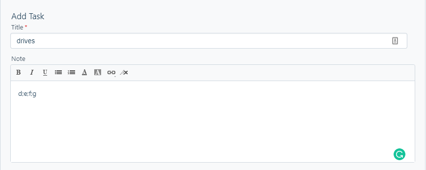
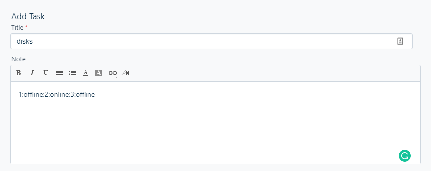
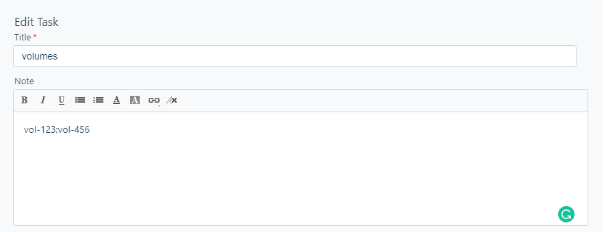
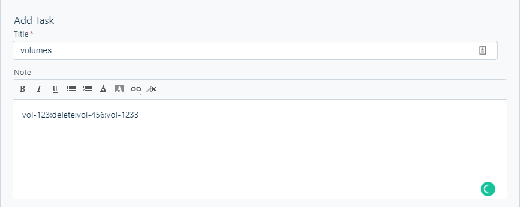

# Disk Removal Automation

*   [Overview](#WindowsDiskRemoval-Overview)
*   [User Section](#WindowsDiskRemoval-UserSection)
    *   [Supported Volume Types](#WindowsDiskRemoval-SupportedVolumeTypes)
    *   [Instructions](#WindowsDiskRemoval-Instructions)
    *   [Task Definition Format](#WindowsDiskRemoval-TaskDefinitionFormat)
        *   [Delete a Volume on Windows Server.](#WindowsDiskRemoval-DeleteaVolumeonWindowsServer.)
        *   [Put a Disk Offline/ Online on Windows Server.](#WindowsDiskRemoval-PutaDiskOffline/OnlineonWindowsServer.)
        *   [Detach ONLY a Volume on AWS.](#WindowsDiskRemoval-DetachONLYaVolumeonAWS.)
        *   [Detach and Delete a Volume on AWS.](#WindowsDiskRemoval-DetachandDeleteaVolumeonAWS.)
    *   [Run the Script](#WindowsDiskRemoval-RuntheScript)
*   [Technical Section](#WindowsDiskRemoval-TechnicalSection)
*   [Admin Section](#WindowsDiskRemoval-AdminSection)
    *   [Dependencies](#WindowsDiskRemoval-Dependencies)
    *   [Environment Variables](#WindowsDiskRemoval-EnvironmentVariables)
*   [Troubleshooting](#WindowsDiskRemoval-Troubleshooting)

Overview
========

This script has been deployed to automate disk removal on Windows Server as well as volume cleanup on AWS.

`This script can only target Windows Machines`

User Section
============

The script can currently perform the following actions:

*   Delete a volume on Windows Server (Please review [this list](#Supported-Volume-Types) for the supported drive types)
    
*   Put a disk offline on Windows Server
    
*   Detach a volume from an Instance on AWS
    
*   Delete a detached volume on AWS
    

All these tasks can be done on demand (as per the user’s necessity).

See the [instructions](#Instructions) for more info.

Supported Volume Types
----------------------

The list of supported drive that can be deleted are:

*   Simple Volumes
    
*   Spanned Volumes
    
*   Stripped Volumes
    
*   Mirrored Volumes
    
*   RAID-5 Volumes
    

Instructions
------------

There are a set of instructions to **strictly** follow in order to run the script correctly.

1.  The correct AWS profile needs to be switched to the desired environment before running the script.
    
2.  A list of tasks should be defined in Fresh Service for each action that you want to be performed. See [this list](#Task-Definition-Format) for the task definition format.
    
3.  Run the script with your change ticket
    

`The script will not take **Closed** tasks into consideration.`

`Your ticket number should be of a Change Request only. Other ticket types are currently not supported.`

Task Definition Format
----------------------

Below is a list of the available actions that can be performed in the script and how to execute them.

The script definition formats are not case-sensitive.

### Delete a Volume on Windows Server.

To delete one or multiple volumes on a Windows Server, a separate task should be defined in your Fresh Service Change Request.

The title of the task should be **drives.**

The description of the task should contain the **drive letters** of the partitions that you want to delete separated by a **semicolon ( ; )**

If you have only one partition to delete, put a single drive letter in the **description.**

Below is a sample screenshot:



### Put a Disk Offline/ Online on Windows Server.

To put one or multiple disks online/offline, a separate task should be defined in your Fresh Service Change Request.

The title of the task should be **disks.**

The description of the task should contain the **disk number** of the partitions that you want to delete, a **colon ( : )**, online / offline depending on the action you want.

For multiple disks, they should be separated by a **semicolon ( ; )**

i.e. If you need Disk 1 to be offline and Disk 2 to be online, your action in the description would be:

**1:offline;2:online**

Below is a sample screenshot:



### Detach ONLY a Volume on AWS.

To detach one or multiple volumes on AWS, a separate task should be defined in your Fresh Service Change Request.

The title of the task should be **volumes.**

The description of the task should contain the **volume IDs** that you want to detach separated by a **semicolon ( ; )**

Below is a sample screenshot:



### Detach and Delete a Volume on AWS.

To detach and delete one or multiple volumes on AWS, you can use a single Fresh Service Task

The title of the task should be **volumes.**

The description of the task should contain the **volumes IDs** that you want to detach and delete, a **colon ( : )**, **delete**.

For volumes, they should be separated by a **semicolon ( ; )**

i.e. If you need volume vol-1234 to be detached and deleted but volume vol-567 to be detached only, your action in the description would be:

**vol-1234:delete;vol-567**

Below is a sample screenshot:



You can use the test Change Request [#CHN-8254](https://checkoutsupport.freshservice.com/itil/changes/8254#tasks) as a reference


Run the Script
--------------

Finally, you can run the script by going where the script is hosted, navigating to the root folder of the script, and running the following command: `ansible-playbook main.yml -e "ticket_number=$TICKET"`

`$TICKET should be set before running the script.`

`Make sure the correct target machine is in the Ansible host.`

`The script has been coded to catch as many errors as possible. However, please be extremely accurate on parameters when running the script. Parameters include ticket numbers, drive letters, volume IDs, etc…`


Technical Section
=================

The script has been coded with a mix of Ansible and Python.

The dependencies below have been used in the script:

*   [Boto3 (AWS Python SDK)](https://boto3.amazonaws.com/v1/documentation/api/latest/index.html)
    
*   [Fresh Service API V2](https://api.freshservice.com/v2/)
    

When a user executes the script, the following actions are executed in order:

1.  The list of tasks is fetched from the ticket in Fresh Service using a Python Script
    
2.  The python script will generate a config file and a [Diskpart](https://docs.microsoft.com/en-us/windows-server/administration/windows-commands/diskpart) batch file.
    
3.  The Ansible playbook will then run this batch file in the target WIndows Server to perform Disk Cleanup as defined in the batch file.
    
4.  The Ansible playbook will then run another script to perform the necessary cleanup on AWS as defined in the config file.
    
5.  The config and batch file will then be erased.
    

Admin Section
=============

The admin section describes how to install and deploy the script in a production environment.

To be able to run the script on your machine, you will need a combination of installed dependencies and environment variables pre-set on the machine.

Dependencies
------------

To install the dependencies, run the following command in the root project directory:

`pip install -r requirements.txt`

Environment Variables
---------------------

A set of environment variables is necessary to be initialized before running the script.

The list below should be written in a file called `secret.env` file and resides in the root project folder

export ENV\_FRESH\_SERVICE\_KEY\_API\_B64=""
export ENV\_FRESH\_SERVICE\_URL="https://checkoutsupport.freshservice.com/api/v2"

`No secret keys are defined for Boto3 as it will make use of the underlying profiles of AWS CLI to run on the desired AWS environment.`

Troubleshooting
===============

Sometimes, the error will not be as predictive as the error message given. To further troubleshoot an issue, each time the script is run, a set of log files is generated and stored in the `log` folder in the `scripts` folder of the project.

Logs file are created for each date and time the script is run and is in the following format:

```
2021-04-15 20:07:21,562 DEBUG retryhandler.py 187 No retry needed.
2021-04-15 20:07:21,562 DEBUG main.py 160 An unexpected error occurred: name 'agent' is not defined
2021-04-15 20:07:21,564 DEBUG connectionpool.py 971 Starting new HTTPS connection (1): slack.com:443
2021-04-15 20:07:22,035 DEBUG connectionpool.py 452 https://slack.com:443 "POST /api/chat.postMessage HTTP/1.1" 200 227
```

`The script has been coded to catch as many errors as possible. However, please be extremely accurate on parameters when running the script. Parameters include ticket numbers, drive letters, volume IDs, etc…`